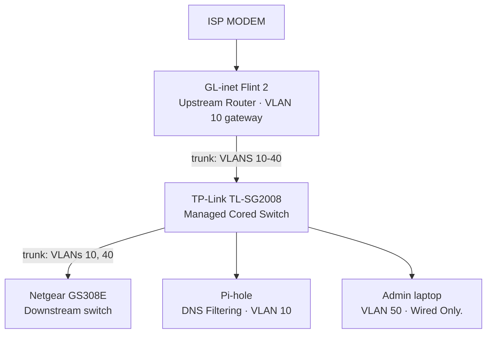

# Lab Architecture

How the lab is wired, segmented, and monitored.

```mermaid
flowchart TB

%%----------Layer 1: The Network----------

ISP[ISP MODEM] --> FLINT[GL-inet Flint 2<br/>Upstream Router · VLAN 10 gateway]

%%Flint sends ONE cable (a trunk) to the TP-Link Switch.
%%That cable carries VLANs 10-40, each tagged with its number.
FLINT -->| trunk: VLANS 10-40| TPL[TP-Link TL-SG2008<br/>Managed Cored Switch]

%%Everything below hangs off the TP-Link.

%%Second Trunk to netgear switch, carrying only VLANs 10 and 40.
TPL -->|trunk: VLANs 10, 40| NG[Netgear GS308E<br/>Downstream switch]

%%Pihole plugs into a regular (untagged) port on VLAN 10.
TPL --> PIHOLE[Pi-hole<br/>DNS Filtering · VLAN 10]

%%Laptop's wired port is on VLAN 50 (Management).
%%Admin access only works over this cable, never on Wi-Fi.

TPL --> LAPTOP[Admin laptop<br/>VLAN 50 · Wired Only.]


```

